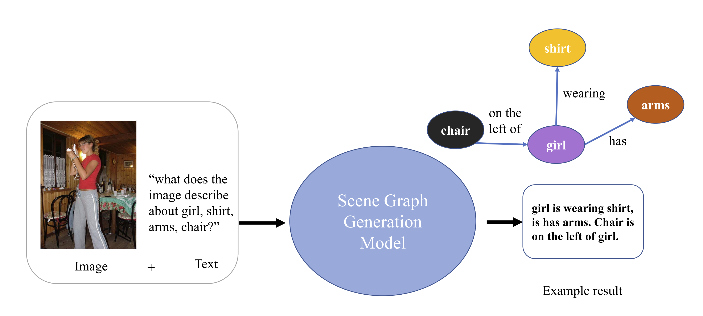
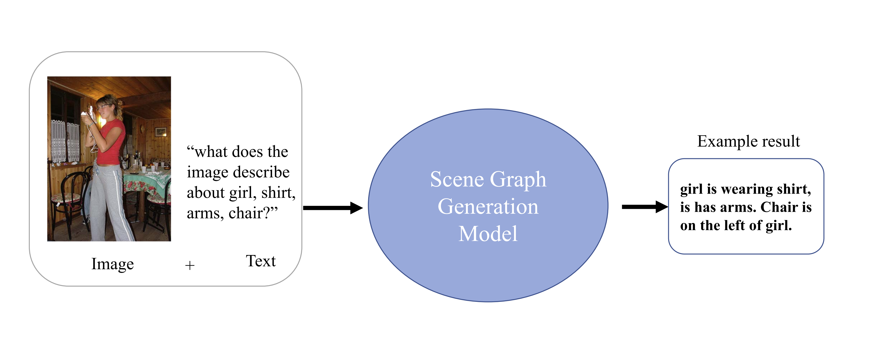
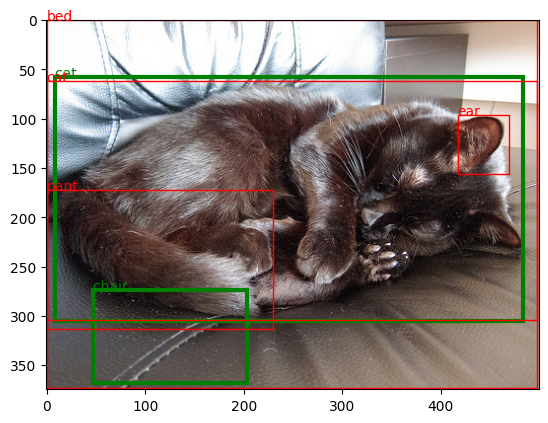
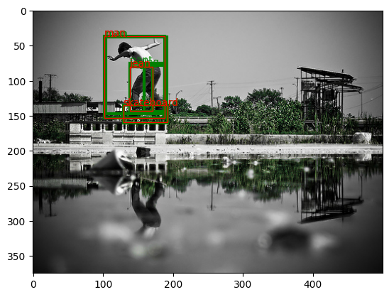

**OFA for scene graph generation (SGG)**

The model is based on [OFA](https://github.com/OFA-Sys/OFA), which is a unified multimodal pretrained Transformer model that unifies modalities. In this task, we propose integrating the SGG task into a unified model with other vision-language tasks. Our approach
involves representing the scene graph as a sequence of objects, bounding boxes and relationships, and using a sequence-to-sequence (Seq2Seq) pipeline to generate an output sequence that is then converted back into the form of a scene graph. This allows the SGG task to be treated as a Seq2Seq task within the same unified model as various other multimodal tasks.


<br></br>

## Dataset Preparation
### GQA
Download the GQA dataset: train_sceneGraphs.json and val_sceneGraphs.json  
attrlabel_glove_taxo.npy, sgg_features.h5, sgg_info.json, gqa_vocab_taxo.json, new_vocab_0822.json  

### VG
Download the VG dataset: VG-SGG-with-attri.h5, VG-SGG-dicts-with-attri.json, image_data.json  
Download the [VG dataset h5 file](https://1drv.ms/u/s!AmRLLNf6bzcir8xf9oC3eNWlVMTRDw?e=63t7Ed)

<br></br>

## Train and Test
Please modify the paths of datasets in the sh files.

To train the SGG task for GQA dataset, run 
```
cd run_sripts/sgg
sh train_sgg_GQA.sh
```
For VG dataset, run
```
sh train_sgg_VG.sh
```

To test the SGG task for GQA or VG dataset, run `sh eval_sgg_GQA.sh` or `eval_sgg_VG.sh`

## Model Structure
### Task Overview


<!-- ### Scene Graph Generation
 -->


## Experiments and Results
Following the evaluation metrics mentioned in [Scene Graph Benchmark](https://github.com/KaihuaTang/Scene-Graph-Benchmark.pytorch/tree/master), we choose the PredCls metric to evaluate our results, which use the ground truth object labels and bounding boxes. However, due to the reason that the predicted object numbers is different from the ground truth, therefore unable to match the object-subject pairs in relation detection evaluation, in this section we do not set the ground truth to the object labels and the bounding boxes. In the "Aligh the number of prediction bbox to ground truth", we use the ground truth.
<!-- ### SGdet
| Models   | mAp  | R@20  | R@50  | R@100 | ng-R@20 | ng-R@50 |ng-R@100 | zR@20 | zR@50 | zR@100 | mR@20 | mR@50 | mR@100 | A@20  | A@50  | A@100 |  
|----------|------|-------|-------|-------|---------|---------|---------|-------|-------|--------|-------|-------|--------|-------|-------|-------|  
| VCTree   | --   | 24.53 | 31.93 | 36.21 | 26.14   | 35.73   | 42.34   | 0.1   | 0.31  | 0.69   | 5.38  | 7.44  | 8.66   | 68.92 | 69.19 | 69.19 |  
| Ofa_tiny | 1.16 | 0.28  | 0.28  | 0.28  | 0.28    | 0.28    | 0.28    | 0.01  | 0.01  | 0.01   | 0.08  | 0.08  | 0.08   | 0.11  | 0.11  | 0.11  |  

### SGCls
| Models   | mAp  | R@20  | R@50  | R@100 | ng-R@20 | ng-R@50 |ng-R@100 | zR@20 | zR@50 | zR@100 | mR@20 | mR@50 | mR@100 | A@20  | A@50  | A@100 |    
|----------|------|-------|-------|-------|---------|---------|---------|-------|-------|--------|-------|-------|--------|-------|-------|-------|  
| VCTree   | --   | 42.77 | 46.67 | 47.64 | 48.94   | 58.36   | 62.70   | 0.45  | 1.17  | 2.08   | 9.59  | 11.81 | 12.52  | 48.47 | 48.59 | 48.59 |
| Ofa_tiny | --   | 0.16  | 0.16  | 0.16  | 1.16    | 2.52    | 4.21    | 0.33  | 0.33  | 0.33   | 0.09  | 0.09  | 0.09   | 0.11  | 0.11  | 0.11  | -->

### PredCls
| Models   | mAp  | R@20  | R@50  | R@100 | ng-R@20 | ng-R@50 |ng-R@100 | zR@20 | zR@50 | zR@100 | mR@20 | mR@50 | mR@100 | A@20  | A@50  | A@100 |    
|----------|------|-------|-------|-------|---------|---------|---------|-------|-------|--------|-------|-------|--------|-------|-------|-------|  
| VCTree   | --   | 59.02 | 65.42 | 67.18 | 67.2    | 81.63   | 88.83   | 1.04  | 3.27  | 5.51   | 13.12 | 16.74 | 18.16  | 68.92 | 69.19 | 69.19 |
| Ofa_tiny | 1.75 | 0.16  | 0.16  | 0.16  | 1.16    | 2.52    | 4.21    | 0.33  | 0.33  | 0.33   | 0.09  | 0.09  | 0.09   | 0.11  | 0.11  | 0.11  |

### Overfit
When debugging, we overfit the model on the training set to see if the results meet our expectation. It seems that the overfit somehow fails to achieve expected results.

Overfit
| Models   | mAp  | R@20  | R@50  | R@100 | ng-R@20 | ng-R@50 |ng-R@100 | zR@20 | zR@50 | zR@100 | mR@20 | mR@50 | mR@100 | A@20  | A@50  | A@100 |    
|----------|------|-------|-------|-------|---------|---------|---------|-------|-------|--------|-------|-------|--------|-------|-------|-------|  
| VCTree   | --   | 59.02 | 65.42 | 67.18 | 67.2    | 81.63   | 88.83   | 1.04  | 3.27  | 5.51   | 13.12 | 16.74 | 18.16  | 68.92 | 69.19 | 69.19 |
| Ofa_tiny | 1.92 | 0.04  | 0.04  | 0.04  | 2.40    | 3.94    | 5.68    | 0.00  | 0.00  | 0.00   | 0.14  | 0.14  | 0.14   | 0.11  | 0.11  | 0.11  |


overfit with objnum loss
| Models   | mAp  | R@20  | R@50  | R@100 | ng-R@20 | ng-R@50 |ng-R@100 | zR@20 | zR@50 | zR@100 | mR@20 | mR@50 | mR@100 | A@20  | A@50  | A@100 |    
|----------|------|-------|-------|-------|---------|---------|---------|-------|-------|--------|-------|-------|--------|-------|-------|-------|  
| VCTree   | --   | 59.02 | 65.42 | 67.18 | 67.2    | 81.63   | 88.83   | 1.04  | 3.27  | 5.51   | 13.12 | 16.74 | 18.16  | 68.92 | 69.19 | 69.19 |
| Ofa_tiny | 2.03 | 0.00  | 0.00  | 0.00  | 0.00    | 0.00    | 0.00    | 0.00  | 0.00  | 0.00   | 0.00  | 0.00  | 0.00   | 0.00  | 0.00  | 0.00  |


<!-- Overfit with bbox loss and objnum loss -->

### Aligh the number of prediction bbox to ground truth
If we set the labels to ground truth, and append the ground truth bbox to the prediction to match the label number, the object detection result should be better than the original PredCls, but the relation prediction result remains about the same.  

| Models   | mAp   | R@20  | R@50  | R@100 | ng-R@20 | ng-R@50 | ng-R@100 | zR@20 | zR@50 | zR@100 | mR@20 | mR@50 | mR@100 | A@20  | A@50  | A@100 |  
|----------|-------|-------|-------|-------|---------|---------|----------|-------|-------|--------|-------|-------|--------|-------|-------|-------|    
| VCTree   | --    | 59.02 | 65.42 | 67.18 | 67.2    | 81.63   | 88.83    | 1.04  | 3.27  | 5.51   | 13.12 | 16.74 | 18.16  | 68.92 | 69.19 | 69.19 |  
| Ofa_tiny | 48.17 | 0.16  | 0.16  | 0.16  | 1.16    | 2.52    | 4.21     | 0.33  | 0.33  | 0.33   | 0.09  | 0.09  | 0.09   | 0.11  | 0.11  | 0.11  |


## Visualization
We visualize our results on the VG images. The red bounding boxes show the predicted results while the green bounding boxes show the ground truth. As illustrated in the images, the predicted sentence is able to contain most of the information from the ground truth sentence. Here are two samples:

**Preciction**: ['cat', [0, 62, 498, 242], 'is', 'on', 'bed', [0, 0, 498, 373], ',', 'has', 'ear', [417, 96, 52, 60], ',earing', 'pant', [0, 172, 230, 141], ',<bin_0><bin_0><bin_996>', '.']  
**Groundtruth**: ['cat ', [9], [58], [483], [305], ' is ', 'in ', 'chair ', [47], [274], [203], [368], ' . ']  


**Preciction**: ['man', [102, 36, 86, 117], 'is', 'wearing', 'jean', [138, 80, 33, 63], ',', 'on', 'skateboard', [129, 135, 63, 24], '.']  
**Groundtruth**: ['man ', [102], [36], [188], [153], ' is ', 'has ', 'leg ', [159], [78], [188], [144], ' , ', 'wears ', 'pant ', [138], [75], [188], [144], ' , ', 'riding ', 'skateboard ', [129], [135], [192], [160], ' . ', 'man ', [104], [37], [191], [147], ' is ', 'has ', 'leg ', [138], [80], [171], [144], ' . ']  



## Analysis
As illustrated in the preceding tables, the result for this method does not achieve as good as the state of the art approaches. This might due to the reason that OFA does not pretrain on long sentences, therefore when the input sequence is long, the output sequence might contain less information. Another reason might be OFA achieves relative low results on object detection, therefore the object number in each image will be less than the ground truth, leading to a poor relation detection result.